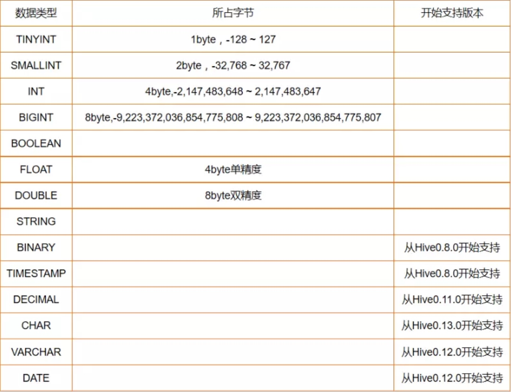
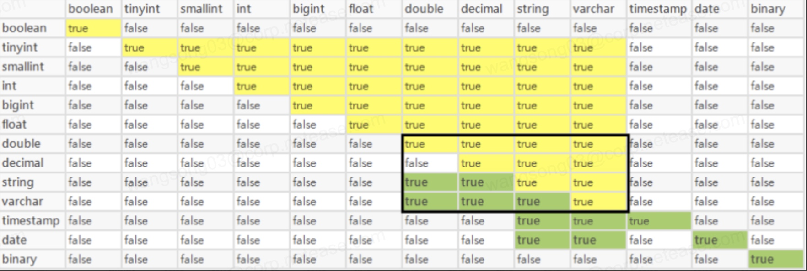

# Hive数据库/表

## Hive数据库
hive中的数据库本质上仅仅是表的一个目录或命名空间(hdfs上)。对于具有很多用户和组的大集群而言，这种方式可以避免表的命名冲突。通常会使用数据库来将生产表组织成逻辑组。数据库在hdfs上的默认路径可以通过hive-site.xml文件中hive.metastore.warehouse.dir属性进行配置，默认为/user/hive/warehouse；

<!-- more -->

### 数据库操作
#### 查看数据库
+ 查看所有数据库：show databases;
```sql
hive> show databases;
OK
default
demo
mammut_db
mammutrepo
poc
tpcds_10g
ui_autotest_db
wangbin
Time taken: 0.022 seconds, Fetched: 8 row(s)
```

+ 根据关键字查看数据库：show databases like 'keyword*';
```sql
hive> show databases like 'wang*';
OK
wangbin
Time taken: 0.031 seconds, Fetched: 1 row(s)
```

+ 查看指定数据库信息：desc database dbname;
```sql
hive> desc database demo;
OK
demo		hdfs://bdms/user/warehouse/demo.db	hive	USER
Time taken: 0.314 seconds, Fetched: 1 row(s)
```

#### 创建数据库
通过Hive Cli或者JDBC链接hive后,执行创建命令即可，创建时可指定数据库名、数据库对应hdfs路径、数据库备注以及数据库附加属性等,命令格式如下：
```sql
CREATE DATABASE [IF NOT EXISTS] database_name  [COMMENT database_comment]  [LOCATION hdfs_path]     [WITH DBPROPERTIES (property_name=property_value, ...)]
```
```sql
hive> create database demo comment 'demo database' location '/user/hive/warehouse/demo.db' with dbproperties ('remark'='demo remark');
```

+ comment:指定数据库备注信息，可省略
+ location:指定数据库hdfs路径，如不执行，则默认路径为hive-site.xml中配置路径
+ dbproperties：用于记录数据库附加属性，如属主、用途等；（仅用于记录）

#### 修改数据库
hive数据库一旦创建之后，仅可修改属主、权限信息及dbproperties中键值对信息，数据库名及数据库位置均不可变更；
```sql
hive> alter database demo set dbproperties('owner'='semon');
hive> alter database demo set owner = 'semon';
```

#### 删除数据库
Hive在进行数据库删除时，默认会检查该库下是否存在表，如存在表时删除数据库会抛出InvalidOperationException异常，并提示该库非空；如需要将数据库和库下所有数据表一起删除，需添加cascade关键字；
```sql
hive> drop database demo cascade;
OK
Time taken: 3.485 seconds
```

## Hive数据表
Hive表与传统数据库表概念类似，由描述表结构的元数据与表数据组成，但Hive的元数据与表数据是分离存储的，元数据由hive-site.xml配置的rds数据库进行存储，表数据由分布式文件存储系统如HDFS、S3等存储；
    Hive中表分为两大类托管表(Managed table)也称之为受控表或内部表另外一种表是外部表(External table)。默认情况下，创建hive表时，hive会把数据存储到它的数据仓库目录下，这种方式创建的表我们称之为受控表。另外一种方式是创建一个外部表(External table)。此时，我们只需要告诉hive数据的外部引用地址，hive本身不会在自己的数据仓库目录下存储这些数据。

### Hive表分类
#### 按惯例模式分类；
+ 内部表
默认情况下，hive创建的表为内部表，表的元数据信息存放在指定rds中，数据文件默认存储在hive-site.xml文件配置的默认路径下；当删除内部表时，将会同时删除rds中元数据信息及hdfs中数据文件；
+ 外部表
创建表时添加external关键字来指定创建表为外部表，外部表创建时需指定数据文件存储hdfs路径，如不指定路径，则同样使用hive-site.xml文件配置的默认路径；当删除外部表时，仅删除rds中表对应元数据信息，hdfs上存储表数据将会保留下来；
#### 按存储结构分类
+ 普通表
普通表将所有数据完全存储在表对应hdfs目录下，表数据查询效率与数据文件成反比变化；
+ 分区表
Hive分区表其实是通过hdfs文件子目录方式实现，根据分区键，将文件存储在对应分区子目录中，通过分区剪裁可直接读取分区中数据，替身刚查询效率
+ 分桶表
分桶表相当于rds中hash分区表，分桶键hash后桶数量进行取模分配数据至指定桶中，每个桶对应hdfs上一个文件； 
    + 分桶表中文件均为有序的；
    + load data可加载数据至表中，但无法实现分桶；

### Hive创建表
Hive建表语法模板如下：
```sql
Create [EXTERNAL] TABLE [IF NOT EXISTS] table_name
[(col_name data_type [COMMENT col_comment], ...)]
[COMMENT table_comment]
[PARTITIONED BY (col_name data_type [COMMENT col_comment], ...)]
[CLUSTERED BY (col_name, col_name, ...) [SORTED ，BY (col_name [ASC|DESC], ...)] INTO num_buckets BUCKETS]
[ROW FORMAT delimited fields terminated by 'f_terminated' SERDE 'table_serde' ]
[STORED AS file_format]
[LOCATION hdfs_path]
``` 

+ create table表示创建一个指定名字的表。如果相同名字的表已经存在，则抛出异常；用户可以使用if not exists选项来忽略这个异常。

+ external关键字表示用户可以创建一个外部表，在建表的同时通过location来指定实际数据的路径，hive创建内部表时，会将数据移动到数据仓库指向的路径；若创建外部表，仅记录数据所在的路径，不对数据的位置做任何改变。在删除表的时候，内部表的元数据和数据会被一起删除，而外部表只删除元数据，不删除真实数据。

+ delimited fields terminated by用于指定列分隔符，SERDE 用于指定文件序列反序列类，常用serde为：
    + org.apache.hadoop.hive.serde2.lazy.LazySimpleSerDe--文本文件
    + org.apache.hadoop.hive.serde2.ParquetHiveSerDe--parquet文件
    + org.apache.hadoop.hive.serde2.OpenCSVSerde--csv文件
    + org.apache.hive.hcatalog.data.JsonSerDe--json文(需第三方jar包支持)
    
+ stored as用于指定表数据存储格式，常见格式为：
    + 文本文件--stored as textfile
    + 压缩文件--stored as sequencefile
    + 列存文件--stored as parquet
    
+ 有分区的表可以在创建的时候使用Partitioner by语句。一个表可以拥有一个或者多个分区，每个分区会单独存在一个目录下。而且表和分区都可以对某个列进行clustered by操作，将若干个列放入一个桶(bucket)中。也可以利用sort by对数据进行排序。这样可以为特定应用提高性能。

+ 样例：
    ```sql
    create table if not exists xf.demo_table
    (
    id int comment '编码',
    name string comment '名称'
    )
    partitioned by (month string,day string)
    comment '表注释'
    row format delimited fields terminated by '\t'
    SERDE 'org.apache.hive.hcatalog.data.JsonSerDe' 
    location '/user/poc/hivesrc/xf.db/demo_table' 
    with tblproperties('lifecycle'='30d','SYNC_METASTORE'='on')
    ```
    
### Hive删除表
Hive删除表语法如下：
```sql
DROP TABLE DBNAME.TABLENAME;
```

+ Hive删除表需切换至表所属DB下，或者删除表时指定完整的dbname与tablename

### Hive修改表
#### Hive增删分区
+ 增加分区
```sql
ALTER TABLE table_name ADD partition_spec [ LOCATION 'location1' ] partition_spec [ LOCATION 'location2' ]
其中partition_spec的格式为：PARTITION(partition_col=partition_col_val,partition_col=partition_col_val,...)
```

    + 当分区名是字符串时要加引号，且可针对分区指定hdfs路径，如：
    
        ```sql
        alter table test_partition add partition(dt='2019-04-22') location '/home/zhangxin/hive/test_partition/dt=2019-04-22
        ```
    
+ 删除分区
```sql
ALTER TABLE table_name DROP partition_spec, partition_spec,...
```
    + 删除分区可一次性删除多个分区，如：
    
        ```sql
        alter table test_partition drop partition(dt='2019-04-21',dt='2019-04-22')
        ```

#### Hive表变更
##### Hive表名变更
表重命名必须在同一个Hive数据库下操作，且表的数据内容及元数据信息(除表名)均不发生改变；

```sql
USE dbname;
ALTER TABLE table_name RENAME TO new_table_name;
```

##### Hive表字段变更
+ Hive表修改字段

    ```sql
    ALTER TABLE tablename change col1 col1 String after col2;
    ```
    
    + 可指定修改字段类型、备注或位置
+ Hive表添加/替换字段

    ```sql
    ALTER TABLE tablename ADD/REPLACE COLUMNS (col1  String [comment col_comment]);
    ```
  + 添加字段仅允许在表字段最后添加(分区键之前)
+ Hive表删除字段

    ```sql
    ALTER TABLE tablename DROP COLUMN col1；
    ```
    
##### Hive属性变更
+ Hive表Serde变更

    ```sql
    ALTER TABLE table_name SET SERDE serde_class_name
    ```
+ Hive表存储格式变更

    ```sql
    ALTER TABLE table_name SET FILEFORMAT file_format
    ```
+ Hive表tableproperties变更

    ```sql
    ALTER TABLE table_name SET tableproperties('KEY_NAME'='VALUE')
    ```

##### Hive表信息查看

```sql
--查看表结构基本信息
desc tablename;
--查看表详细信息，包括存储格式、Serde等
desc formatted tablename;
--查看表建表语句
show create table tablename;

```

## Hive数据类型
### 基础数据类型


### 复杂数据类型
+ ARRAY：ARRAY类型是由一系列相同数据类型的元素组成，这些元素可以通过下标来访问。比如有一个ARRAY类型的变量fruits，它是由 ['apple','orange','mango']组成，那么我们可以通过fruits[1]来访问元素orange，因为ARRAY类型的下标是从 0开始的； 
+ MAP：MAP包含key->value键值对，可以通过key来访问元素。比如”userlist”是一个map类型，其中username是 key，password是value；那么我们可以通过userlist['username']来得到这个用户对应的password； 
+ STRUCT：STRUCT可以包含不同数据类型的元素。这些元素可以通过”点语法”的方式来得到所需要的元素，比如user是一个STRUCT类型，那么可以通过user.address得到这个用户的地址。 

### 隐式转换
+ 任意数值类型都可以转换成更宽的数据类型（不会导致精度丢失）或者文本类型,其中 decimal 仅可隐式转换为String或varchar。
+ 所有的文本类型都可以隐式地转换成另一种文本类型。也可以被转换成DOUBLE或者DECIMAL，转换失败时抛出异常。
+ BOOLEAN不能做任何的类型转换。
+ 时间戳和日期可以隐式地转换成文本类型。
Hive 支持的隐式转换详见下图：



### 显示转换
Hive 可通过 cast (columns as column_type)进行显示转换，转换失败时返回NULL；

## Hive数据存储格式
目前主流数据存储格式分为列式存储与行式存储；
+ 行式存储：
    + 优点：相关的数据是保存在一起，比较符合面向对象的思维，一行数据就是一条记录，便于进行INSERT/UPDATE操作；
    + 缺点：查询一列数据也需要读取整行数据，数据量较大时影响性能；行中各列数据类型无法保持一致，无法获得较高压缩比，空间利用率较低；只有部分列可作为索引；

+ 列式存储：
    + 优点：可使用列剪裁，仅读取查询需要的列数据；高效压缩率，节省存储、内存及CPU；所有列均可作为索引；
    + 缺点：INSERT/UPDATE支持较差；

### 常见Hive文件存储格式
Apache Hive支持Apache Hadoop中使用的几种熟悉的文件格式，如TextFile，RCFile，SequenceFile，AVRO，ORC和Parquet格式。Cloudera Impala也支持这些文件格式。 在建表时使用STORED AS (TextFile|RCFile|SequenceFile|AVRO|ORC|Parquet)来指定存储格式。

+ TextFile：每一行都是一条记录，每行都以换行符（\ n）结尾。数据不做压缩，磁盘开销大，数据解析开销大。可结合Gzip、Bzip2使用（系统自动检查，执行查询时自动解压），但使用这种方式，hive不会对数据进行切分，从而无法对数据进行并行操作。
+ SequenceFile：是Hadoop API提供的一种二进制文件支持，其具有使用方便、可分割、可压缩的特点。支持三种压缩选择：NONE, RECORD, BLOCK。 Record压缩率低，一般建议使用BLOCK压缩。
+ RCFile：是一种行列存储相结合的存储方式。首先，其将数据按行分块，保证同一个record在一个块上，避免读一个记录需要读取多个block。其次，块数据列式存储，有利于数据压缩和快速的列存取。
+ AVRO：是开源项目，为Hadoop提供数据序列化和数据交换服务。您可以在Hadoop生态系统和以任何编程语言编写的程序之间交换数据。Avro是基于大数据Hadoop的应用程序中流行的文件格式之一。
+ ORC：ORC代表了优化排柱状的文件格式。ORC文件格式提供了一种将数据存储在Hive表中的高效方法。这个文件系统实际上是为了克服其他Hive文件格式的限制而设计的。Hive从大型表读取，写入和处理数据时，使用ORC文件可以提高性能。
+ Parquet：是一个面向列的二进制文件格式。Parquet对于大型查询的类型是高效的。对于扫描特定表格中的特定列的查询，Parquet特别有用。Parquet支持使用压缩Snappy，gzip;目前Snappy默认。

#### 存储格式对比

| 存储格式 | 存储方式 | 特点 |
| --- | --- | --- |
| TextFile | 行式 | 加载速度快；<br> 存储消耗大；<br>压缩后无法分割合并； |
| SequenceFile | 行式 | 查询效率高；<br> 压缩后可分割合并；<br>存储消耗大；<br>需通过text加载； |
| RCFile | 按行分块<br> 按列存储 | 存储消耗小；<br> 查询效率高；<br>加载速度快；<br>压缩速度快；<br>支持列剪裁；<br>读取记录尽量涉及较少分块数据；<br>全量读取效率与SequenceFile相仿；<br>不支持impala； |
| ORC | 按行分块<br> 按列存储 | RCFile改良版；  |
| Parquet | 列式 | 支持列剪裁；<br> 支持impala；<br>其他方面略低于ORC； |
