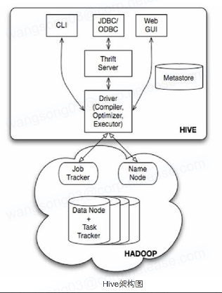

# Hive简介
## HIVE 的历史

HIVE是著名的社交网站Facebook研发的。

<!-- more -->

在Facebook中有很大的一个hadoop集群，为了方便存储和计算数据，开发需要在MapReduce解决这些问题。但是让所有的DBA都学习MapReduce，显然不高效，因为MapReduce在写之前，至少要会一门编程语言（java），写一些自己想要的需求，难度很大。于是诞生了hive ，操作类似于关系数据的库的sql。

## HIVE是什么？

HIVE是基于Hadoop的数据仓库解决方案。在Hadoop生态圈中，HIVE是必不可少的一个工具，它提供一种SQL方言，可以查询存储在HDFS中的数据。

简单的说： HIVE就是在Hadoop上架了一层SQL接口，可以将SQL翻译成MapReduce去Hadoop上执行，这样就使得数据开发和分析人员很方便的使用SQL来完成海量数据的统计和分析，而不必使用编程语言开发MapReduce那么麻烦。

## HIVE架构图

HIVE通过给用户提供的一系列交互接口，接收到用户的指令(SQL)，使用自己的Driver，结合元数据(MetaStore)，将SQL解析成Mapreduce，提交到Hadoop中执行，最后，将执行返回的结果输出。在使用过程中，只需要将Hive看做是一个数据库就行，本身Hive也具备了数据库的很多特性和功能。 Metastore: 存储Hive库、表的元数据库 Driver：负责提交、优化、执行SQL 连接Hive的方式：

## HIVE和关系型数据库的区别

关系型数据库对于数据会校验。HIVE不会。HIVE对事务的支持不够好，不能使用Hive来完成诸如DELETE、UPDATE等在线事务处理的需求。

## HIVE依赖环境

需要搭建jdk和hadoop

## HIVE的优缺点及适用场景

HIVE使用HQL很方便的完成对海量数据的计算，除了系统内置函数，还支持使用其他编程语言和脚本语言来编写UDF。 但是，由于Hadoop本身是一个批处理，高延迟的计算框架，Hive使用Hadoop作为执行引擎，自然也就有了批处理，高延迟的特点，在数据量很小的时候，Hive执行也需要消耗较长时间来完成，这时候，就显示不出它与Oracle，MySQL等传统数据库的优势。 此外，Hive对事务的支持不够好，原因是HDFS本身就设计为一次写入，多次读取的分布式存储系统，因此，不能使用Hive来完成诸如DELETE、UPDATE等在线事务处理的需求。 因此，Hive擅长的是非实时的、离线的、对响应及时性要求不高的海量数据批量计算，即席查询，统计分析。

优点：

（1） 操作接口采用类SQL语法，提供快速开发的能力(简单、容易上手)；  
（2） 避免了去写MapReduce，减少开发人员的学习成本；  
（3） 统一的元数据管理，可与impala/spark等共享元数据；  
（4）易扩展(HDFS+MapReduce：可以扩展集群规模；支持自定义函数)；  
（5） 数据的离线处理；比如：日志分析，海量结构化数据离线分析；

缺点：
（1） Hive的执行延迟比较高，因此HIVE常用于数据分析的，对实时性要求 不高的场合；
（2）Hive优势在于处理大数据，对于处理小数据没有优势，因为HIVE的执 行延迟比较高。
