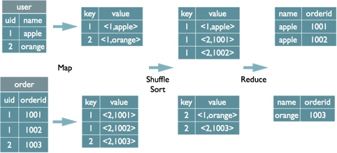
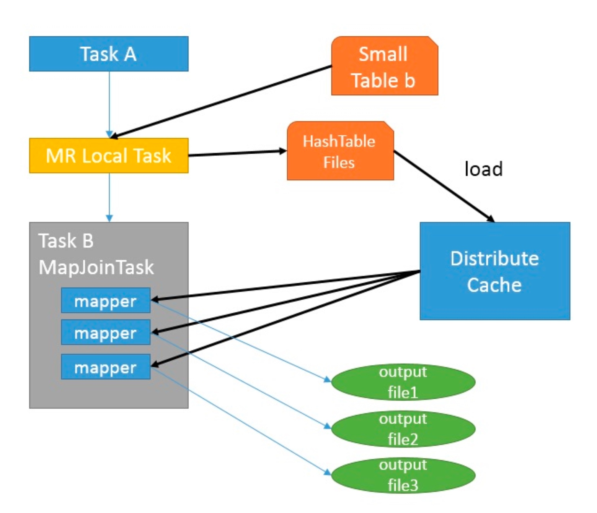
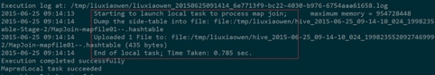

# MR任务原理
MR任务由三个阶段组成：Map task、Shuffle和Reduce task；

<!-- more -->

## Map task
Map读取源表数据，并根据文件大小及文件个数生成map tasks；影响map个数（split个数）的主要因素有：
+ 文件的大小。当块（dfs.block.size）为128m时，如果输入文件为128m，会被划分为1个split；当块为256m，会被划分为2个split。
+ 文件的个数。FileInputFormat按照文件分割split，并且只会分割大文件，即那些大小超过HDFS块的大小的文件。如果HDFS中dfs.block.size设置为128m，而输入的目录中文件有100个，则划分后的split个数至少为100个。
+ splitsize的大小。分片是按照splitszie的大小进行分割的，一个split的大小在没有设置的情况下，默认等于hdfs block的大小。但应用程序可以通过两个参数来对splitsize进行调节。

InputSplit的计算公式为：

```
InputSplit=Math.max(minSize, Math.min(maxSize, blockSize)
    其中：
    minSize=mapred.min.split.size
    maxSize=mapred.max.split.size
```

### 读取
map task将hdfs文件数据读入内存环形缓冲区，生成key-value对：
+ key：Join on条件中的字段为key，如果join on存在多个字段，则以这些字段组合后作为key；并以key的hash值对reduce task数量取模的结果进行partition，如果任务为用户自定义MR任务，也可自定义partitioner对map读取的数据进行分区；

+ value：value的值为select子句或where子句中所引用的所有列，同时也包含表的tag信息，用户表名此value属于哪个表；

### 溢写
当读入到内存环形缓冲区的数据达到阈值(由mapreduce.map.sort.spill.percent参数配置，默认为0.8)时，map task将启动单独线程锁定该内存区域、排序（按照partition和key进行排序）及向磁盘溢写；对partition排序将提高shuffle阶段读取效率，对key排序将提升后续merge阶段效率；
如果为用户自定义MR任务，且配置了combiner，那么在数据溢写前还将调用combiner进行数据合并，如*{“aaa”, 1}，{“aaa”, 3}*将被合并为*{“aaa”, 4}*，减少向磁盘溢写的数据量；
### 归并
map每次向磁盘溢写(spill)都将生成一个溢写文件，当map的数据结果很大时，将会产生大量的溢写文件；当map task结束时，环形缓冲区中剩余的数据也将全部溢写至磁盘生成一个溢写文件，然后触发merge操作，将所有的溢写文件归并为一个文件，此过程会同时会将相同key的value合并为group，如*{“aaa”, 1}，{“aaa”, 3}，{“aaa”, 2}*将会被合并为*{“aaa”, [1，3，2]}*，此时同样会出发对key进行排序操作；
如果为用户自定义MR任务，且配置了combiner，那么在合并过程中也将调用combiner进行数据合并；

当数据合并完成后，map task阶段正式结束，并向jobTracker报告map task已结束；

## Shuffle
Shuffle阶段其实可以细分为两个阶段：拷贝阶段与合并阶段；Reduce task通过rpc向job Tracker询问当前map task的状态，如map task已完成，则开始进行shuffle；
### 拷贝
拷贝阶段为简单的拉取数据；reduce task会启动一些Fetcher线程，通过http方式请求map task所在的Task tracker获取map合并后的文件存储路径；Fetcher线程从各个map task拉取过来的数据保存至内存缓冲区中；

### 合并
Shuffle阶段的合并与map阶段的归并类似，区别在于内存缓冲区中数据为从各个map task拉取过来的数据；此处的内存缓冲区大小比较灵活，他基于jvm的heap size来设置；因为Shuffle阶段，reducer尚未运行，故因将大部分内存分配给Shuffle使用。Shuffle阶段的合并有三种模式：内存到内存，内存到硬盘，硬盘到硬盘；默认不启用内存到内存.
与map task类似，当内存缓冲区达到阈值后，启动溢写（默认启动对key排序）；如配置了combiner，则溢写前会进行一次合并操作；直到内存中所有数据均溢写至硬盘后，启用归并操作，将所有溢写文件归并为一个结果文件供reducer使用，该文件的生成表名Shuffle阶段结束；其中，溢写阶段为内存到硬盘模式，合并阶段为硬盘到硬盘模式；
当reduce拉取的数据量较小时，文件直接在内存缓冲区中完成归并后直接输出给reducer，溢写阶段被跳过，但排序操作仍会发生；

## Reduce task
将shuffle生成的数据读入reducer后会调用groupingcomparator进行分组，按照分组每次获取一组数据并调用用户自定义reduce方法对数据进行逻辑运算，最后调用outputformat会将内容写入到hdfs文件中；

## MR任务分类
MR任务总的来说，可以分为两大类：Common Join与Map Join；

### Common Join
Common Join即为常规的MR任务，包含Map task、Shuffle和Reduce task；以一段HQL为例来详细说明Common Join执行过程；

```sql
SELECT U.NAME,U.BALANCE,O.ORDER_ID FROM USERS U JOIN ORDERS O ON U.UID=O.UID
```


#### HQL转换MR任务
+ Map阶段
map task读取HQL语句中所有来源表，生成k-v对，以Join on条件中的列作为key，如果条件中存在多个列，则以多个列组合后作为key；以表tag(标记不同来源表)+HQL语句中所引用的所有列(包括SELECT和WHERE语句引用)组合起来作为value；
+ Shuffle阶段
根据map阶段生成的partition信息，将溢写文件拷贝至对应的reduce task中，根据partition生成原理，相同的key对应的数据必然会被拉取至同一个reduce task中；（同一个reduce中可以包含多个不同的key）
+ Reduce阶段
经过Shuffle阶段后，HQL引用表的相同键值的数据都汇聚在了同一个reduce task中，reduce将同一key对应来自不同表的value进行笛卡尔积，即可得到最终结果

#### HQL转换Job数量计算
Hive执行引擎会将HQL"翻译"为MR任务进行执行，根据HQL中join on的列来计算一个HQL会转换为多少个Job；
+ 多张表通过同一列进行关联，则转换为一个Job（关联字段可不同名，但需满足值传递）；
+ HQL存在全局聚合(如sum函数)或排序函数(如order by)会增加一个Job；
+ 子查询中存在聚合或排序会增加一个Job（多个子查询中均存在聚合或排序函数会增加多个Job）；

```sql
--三表关联仅生成一个Job
select * from tbl_a a join tbl_b b on a.key_a=b.key_b join tbl_c c on a.key_a=c.key_c

--三表关联仅生成一个Job
select * from tbl_a a join tbl_b b on a.key_a=b.key_b join tbl_c c on b.key_b=c.key_c

--三表关联生成两个Job
select * from tbl_a a join tbl_b b on a.key_a=b.key_b join tbl_c c on b.key_b1=c.key_c

--三表关联生成三个Job
select count(*) from tbl_a a join tbl_b b on a.key_a=b.key_b join tbl_c c on b.key_b1=c.key_c
```

### Map Join
MapJoin通常用于一个很小的表和一个大表进行join的场景，具体小表有多小，由参数hive.mapjoin.smalltable.filesize来决定，该参数表示小表的总大小，默认值为25000000字节，即25M。 
Hive0.7之前，需要使用hint提示 /+ mapjoin(table) /才会执行MapJoin,否则执行Common Join，但在0.7版本之后，默认自动会转换Map Join，由参数hive.auto.convert.join来控制，默认为true. 
假设a表为一张大表，b为小表，并且hive.auto.convert.join=true,那么Hive在执行时候会自动转化为MapJoin。


如图中的流程，首先是Task A，它是一个Local Task（在客户端本地执行的Task），负责扫描小表b的数据，将其转换成一个HashTable的数据结构，并写入本地的文件中，之后将该文件加载到DistributeCache中，该HashTable的数据结构可以抽象为：
key	Value
1	26
2	34




图中红框圈出了执行Local Task的信息。

接下来是Task B，该任务是一个没有Reduce的MR，启动MapTasks扫描大表a,在Map阶段，根据a的每一条记录去和DistributeCache中b表对应的HashTable关联，并直接输出结果。 
由于MapJoin没有Reduce，所以由Map直接输出结果文件，有多少个Map Task，就有多少个结果文件。
总的来说，因为小表的存在，可以在Map阶段直接完成Join的操作，为了优化小表的查找速度，将其转化为HashTable的结构，并加载进分布式缓存中。

### SMB Join

smb是sort  merge bucket操作，首先进行排序，继而合并，然后放到所对应的bucket中去，bucket是hive中和分区表类似的技术，就是按照key进行hash，相同的hash值都放到相同的buck中去。在进行两个表联合的时候。我们首先进行分桶，在join会大幅度的对性能进行优化。也就是说，在进行联合的时候，是table1中的一小部分和table1中的一小部分进行联合，table联合都是等值连接，相同的key都放到了同一个bucket中去了，那么在联合的时候就会大幅度的减小无关项的扫描。
在这里如果需要使用SMB join必须需要使用分桶表：

```sql
create table emp_info_bucket(ename string,deptno int)
partitioned by (empno string)
clustered by(deptno) into 4 buckets;

create table dept_info_bucket(deptno string,dname string,loc string)
clustered by (deptno) into 8 buckets;
```
ps: 
1. 两个表关联键为id，需要按id分桶并且做排序，小表的分桶数是大表分桶数的倍数。 
2. 对于map端连接的情况，两个表以相同方式划分桶。处理左边表内某个桶的 mapper知道右边表内相匹配的行在对应的桶内。因此，mapper只需要获取那个桶 (这只是右边表内存储数据的一小部分)即可进行连接。这一优化方法并不一定要求 两个表必须桶的个数相同，两个表的桶个数是倍数关系也可以 
3. 桶中的数据可以根据一个或多个列另外进行排序。由于这样对每个桶的连接变成了高效的归并排序(merge-sort), 因此可以进一步提升map端连接的效率
 

 

下列为具体使用：

```sql
set hive.auto.convert.sortmerge.join=true;
set hive.optimize.bucketmapjoin = true;
set hive.optimize.bucketmapjoin.sortedmerge = true;
set hive.auto.convert.sortmerge.join.noconditionaltask=true;


select * from emp_info_bucket emp  join dept_info_bucket dept
on(emp.deptno==dept.deptno);
```

